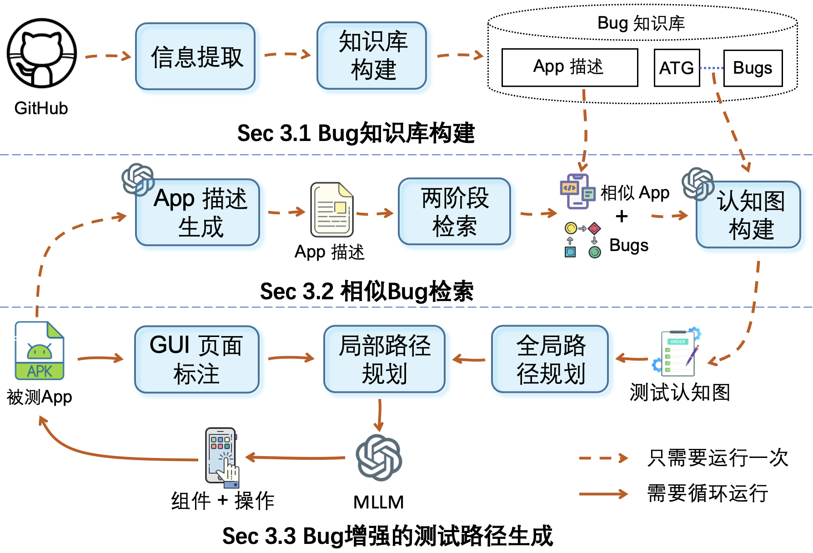

# BugChaser：通过检索增强的 Bug感知自动化 GUI 测试

## 概述

BugChaser 是一种新颖的 Bug 感知自动化 GUI 测试方法，它利用大型语言模型（LLMs）和检索增强生成（RAG）来生成由类似应用的 Bug 报告引导的探索路径。这种方法旨在通过动态适应测试过程以针对 Bug 路径，而不是仅仅关注覆盖率，来提高 Bug 检测效率。

以下是 BugChaser 的概述结构：



## 主要特点
- Bug 知识库：从历史 Bug 报告中构建高质量的 Bug 知识库。
- 两阶段检索：使用两阶段检索过程检索相关 Bug 报告。
- 路径生成：基于类似应用的 Bug 报告生成测试路径。
- 本地和全局路径规划：处理应用之间的功能和 UI 设计差异。
- 高效 Bug 检测：通过针对 Bug 路径提高 Bug 检测效率。

## 模块

1. 知识库构建
   从开源应用及其 Bug 报告中提取信息。
   将 Bug 报告映射到活动转换图（ATG）以形成一个结构化的知识库。
2. 相似 Bug 检索
   使用两阶段检索过程识别相关 Bug 报告。
   构建测试认知图，将类似应用的 Bug 报告映射到目标应用的 ATG。
3. Bug 增强路径生成
   注释 GUI 屏幕截图，帮助 LLMs 准确解释 GUI 元素。
   使用本地和全局路径规划，将触发 Bug 的步骤适应到目标应用特定的 GUI 布局。

## 实现

BugChaser 实现为一个完全自动化的 GUI 测试工具，利用 GPT-4 Vision 进行文本和视觉信息处理，UIAutomator 用于 GUI 视图层次结构提取，BCEmbedding 用于相似性搜索和匹配。系统构建在 VirtualBox、Python pyvbox 和 Android Debug Bridge (ADB) 上。

## 实验

### 研究问题
- RQ1：评估 BugChaser 在检测 Bug 和实现测试覆盖率方面的效果，并与常见和最先进的基线方法进行比较。
- RQ2：进行消融研究，评估每个子模块对覆盖率和 Bug 检测性能的贡献。
- RQ3：通过在 Google Play 上自动探索应用并检测未见过的 Bug，评估 BugChaser 的实用性。

### 数据集

- RQ1 & RQ2：来自 [Themis 基准](https://github.com/the-themis-benchmarks/home) 和 [F-Droid](https://f-droid.org/) 的 71 个应用和 121 个 Bug。
- RQ3：从 Google Play 随机选择的 237 个流行应用。

### 基线方法

包括 16 种常见和最先进的自动化 GUI 测试技术，分为随机/基于规则、基于模型和基于学习的方法。

### 结果

#### Bug 检测性能（RQ1）

BugChaser 在 71 个应用中检测到 121 个 Bug，召回率为 64%，比最佳基线方法（GPTDroid）高出 20%。
实现了 53% 的活动覆盖率和 52% 的代码覆盖率，与最佳基线相当。

#### 消融研究（RQ2）

移除相似 Bug 检索模块和增强路径生成模块，分别将 Bug 检测召回率降低了 50% 和 51%。

#### 实用性（RQ3）

BugChaser 在 Google Play 上的 273 个应用中检测到 49 个新的崩溃 Bug，其中 33 个已修复，9 个由开发者确认，7 个待反馈。

## 快速开始

创建你的 Python 环境：

```
conda create -n BugChaser python=3.10 -y
conda activate BugChaser
```

安装所需的包：

```
pip install requirements.txt
```

要运行 BugChaser，你应该：

1. 在 `src/config.ini` 中更改你的路径
2. 运行 `python main.py`

## 致谢

更多详情，请参考全文。
